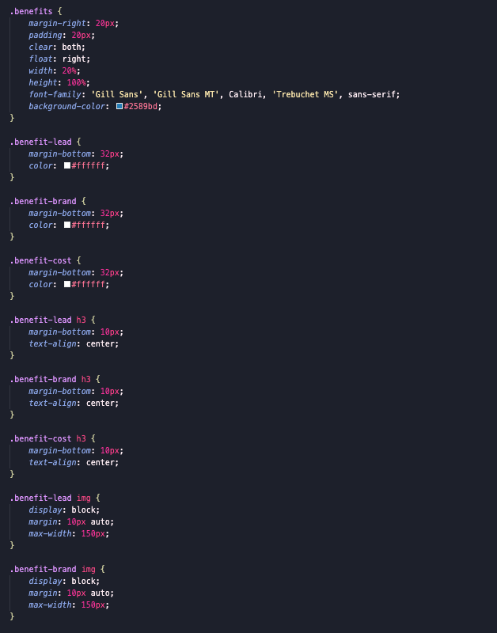

# codeRefactor

This assignment required me to refactor an existing code. 

;

;

* I condensed the codes from the CSS file.

This is the screenshot of the code before I refactored it:

;

This is the screenshot of the code after I refactored it:

![After Refactor] (assets/images/afterss.png);